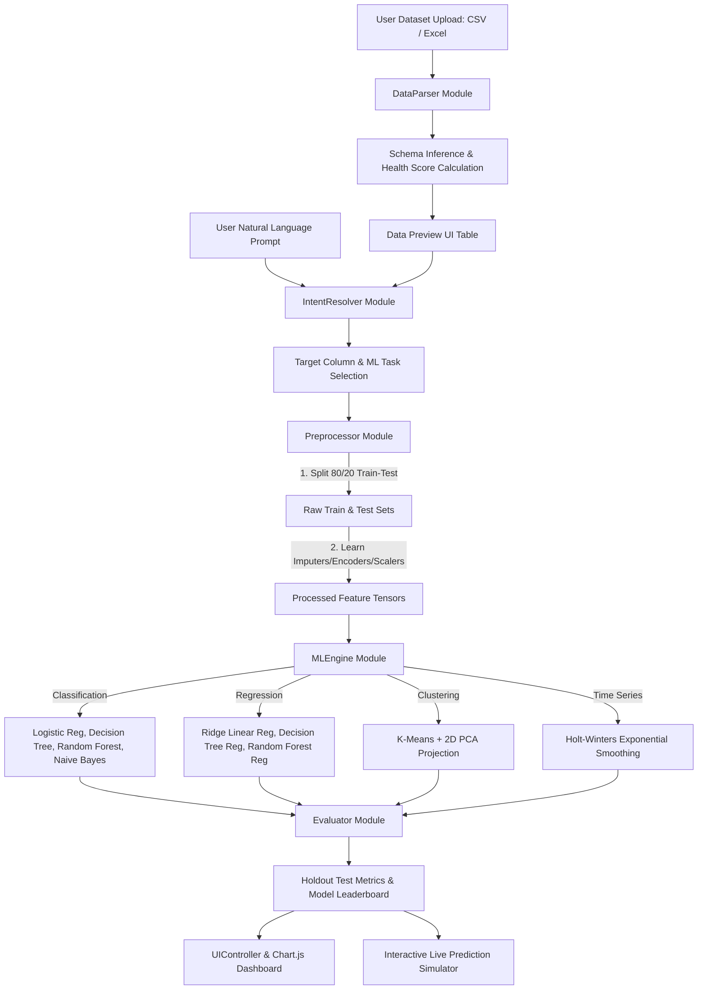

# Comprehensive System Documentation: DataMind AutoML

## 📌 Executive Summary

**DataMind AutoML** is a high-performance, client-side automated machine learning (AutoML) web application. It enables users to:
1. Upload structured datasets in **CSV** and **Excel** formats (`.csv`, `.xlsx`, `.xls`).
2. Express analytical goals using **Natural Language Prompts** or **Smart Goal Cards**.
3. Automatically execute dataset cleaning, schema inference, featurization, and train/test splits.
4. Concurrently train and compare multiple supervised and unsupervised Machine Learning models.
5. Inspect leaderboard metrics, feature importances, and interactive visual charts.
6. Test live predictions using an **Interactive Prediction Simulator Sandbox**.

---

## 🏛️ System Architecture



---

## 📦 Directory & File Structure

```
smart-automl-app/
├── index.html                  # Core HTML5 layout & responsive component containers
├── style.css                   # Modern dark-theme glassmorphism CSS design system
├── README.md                   # Repository overview & quickstart guide
├── DOCUMENTATION.md            # Complete technical system documentation
├── .gitignore                  # Git tracking exclusion list
├── assets/
│   └── dashboard_preview.png   # High-resolution dashboard UI screenshot asset
└── js/
    ├── app.js                  # Main orchestrator & event bus
    ├── dataParser.js           # CSV (PapaParse) & Excel (SheetJS) parser
    ├── intentResolver.js       # Natural language NLP & goal recommender engine
    ├── preprocessor.js         # Strict featurization ordering & data pipeline
    ├── mlEngine.js             # Client-side ML algorithms library
    ├── evaluator.js            # Model metrics, evaluation & leaderboard builder
    ├── sampleDatasets.js       # 4 pre-loaded benchmark datasets
    └── uiController.js         # DOM state manager, Chart.js & sandbox renderer
```

---

## 🔧 Detailed Module Breakdown

### 1. Data Ingestion Module (`js/dataParser.js`)
- **CSV Parsing**: Utilizes `PapaParse` with `header: true`, `dynamicTyping: true`, and empty line filtering.
- **Excel Parsing**: Utilizes `SheetJS (XLSX)`. Parses binary array buffers, extracts sheet names, and converts target worksheet into JSON objects.
- **Schema Inference**:
  - `numeric`: $>80\%$ numerical parsed entries.
  - `categorical`: Nominal or ordinal text variables ($<50$ unique values).
  - `datetime`: ISO / Date string representations ($>70\%$ parse rate).
  - `id`: Sequential integers or unique key patterns.
- **Health Score Algorithm**:
  $$\text{Health Score} = \max\left(0, 100 - \left\lfloor \frac{\text{Total Null Cells}}{\text{Total Cells}} \times 100 \right\rfloor\right)$$

---

### 2. Natural Language Intent Resolver (`js/intentResolver.js`)
- **NLP Intent Analysis**: Parses user text prompts for action keywords (*"predict"*, *"churn"*, *"forecast"*, *"group"*, *"cluster"*, *"price"*).
- **Target Matching**: Matches prompt keywords against dataset column names using fuzzy word boundary overlap.
- **Task Auto-Classifier**:
  - If clustering keywords found $\rightarrow$ **Clustering** (Unsupervised).
  - If datetime column & numeric continuous target found $\rightarrow$ **Time Series**.
  - If categorical target or $\le 15$ unique classes found $\rightarrow$ **Classification**.
  - If continuous numeric target found $\rightarrow$ **Regression**.

---

### 3. Preprocessor Pipeline (`js/preprocessor.js`)
Strictly enforces **Featurization Ordering Best Practices**:
1. **80/20 Train-Test Split**: Dataset is partitioned into training set ($80\%$) and holdout test set ($20\%$) *before* computing scaling or encoding statistics.
2. **Missing Value Imputation**:
   - Numeric features: Imputed using training set mean ($\mu_{\text{train}}$).
   - Categorical features: Imputed using training set mode / `'Missing'` category token.
3. **One-Hot Encoding**: Converts nominal categorical features into binary indicator vectors for top 10 frequent categories.
4. **Standard Scaling**: Normalizes numeric features using $Z$-score standardization fitted exclusively on training set:
   $$z = \frac{x - \mu_{\text{train}}}{\sigma_{\text{train}}}$$

---

### 4. Machine Learning Engine (`js/mlEngine.js`)

#### Classification Suite
- **Logistic Regression**:
  - Optimization: Multi-class One-vs-Rest Gradient Descent with $L_2$ Regularization.
  - Softmax / Sigmoidal activation: $\sigma(z) = \frac{1}{1 + e^{-z}}$.
- **Decision Tree Classifier**:
  - Recursive binary tree splitting based on Gini Impurity reduction:
    $$\text{Gini}(D) = 1 - \sum_{i=1}^{C} p_i^2$$
- **Random Forest Classifier**:
  - Ensemble of $N=5$ decision trees trained on bootstrap resampled subsets with feature split randomization.
- **Gaussian Naive Bayes**:
  - Evaluates log likelihoods based on Gaussian feature distributions:
    $$P(x_i \mid y) = \frac{1}{\sqrt{2\pi\sigma_y^2}} \exp\left(-\frac{(x_i - \mu_y)^2}{2\sigma_y^2}\right)$$

#### Regression Suite
- **Ridge Linear Regression**: $L_2$ regularized OLS cost function optimization.
- **Decision Tree Regressor**: Splitting criteria based on Mean Squared Error (MSE) reduction.
- **Random Forest Regressor**: Ensemble averaging over decision tree estimators.

#### Clustering & Time Series
- **K-Means Clustering**: Iterative expectation-maximization algorithm partitioning observations into $K=3$ clusters. Includes 2D PCA projection for 2D scatter plotting.
- **Holt-Winters Exponential Smoothing**: Double exponential smoothing modeling level ($\alpha$) and trend ($\beta$).

---

### 5. Evaluator & Leaderboard Builder (`js/evaluator.js`)
Computes unbiased metrics on the $20\%$ holdout test dataset:
- **Classification**:
  - Accuracy: $\frac{TP + TN}{TP + TN + FP + FN}$
  - Macro F1-Score: Harmonic mean of Precision and Recall.
  - Confusion Matrix $(C \times C)$.
- **Regression**:
  - $R^2$ Score: $1 - \frac{\sum (y_i - \hat{y}_i)^2}{\sum (y_i - \bar{y})^2}$
  - Root Mean Squared Error (RMSE) & Mean Absolute Error (MAE).
- **Clustering**: Silhouette Score & Within-Cluster Sum of Squares (Inertia).

Ranks models automatically and assigns **#1 Winner** status.

---

### 6. UI & Interactive Sandbox (`js/uiController.js`)
- **Theme**: Dark Navy (`#0a0d14`) with glassmorphism panels, CSS blur filters, and vibrant neon accents (`#6366f1`, `#06b6d4`, `#ec4899`).
- **Charts**: Integrated Chart.js canvas renderers for Feature Importance bar charts, Confusion Matrices, Actual vs Predicted scatter plots, and Cluster diagrams.
- **Prediction Simulator**: Dynamically constructs HTML form fields based on feature schema. Re-evaluates model predictions in real-time as users adjust sliders or inputs.

---

## ⚡ Local Setup & Execution Guide

1. Navigate to the project root directory:
   ```bash
   cd smart-automl-app
   ```
2. Launch a local web server:
   ```bash
   python3 -m http.server 8080
   ```
3. Open your web browser at:
   [http://localhost:8080](http://localhost:8080)

---

## 🔒 Security & Data Privacy

All computation runs **100% inside the client's browser environment**. No data rows, features, or user queries are sent to external servers or third-party cloud endpoints.
