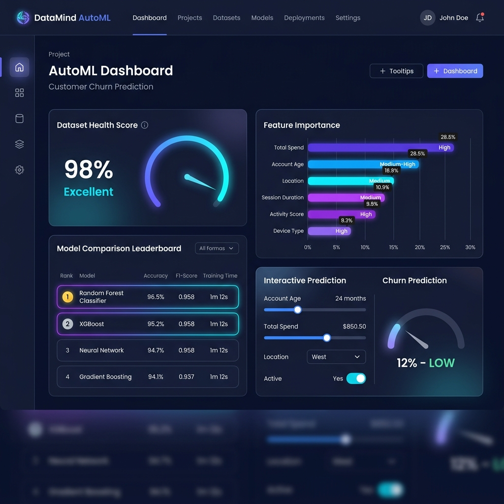
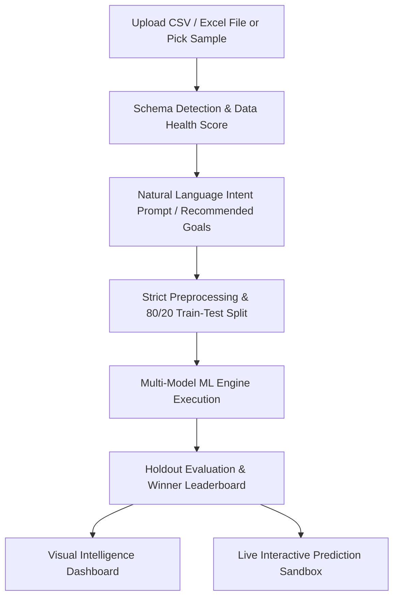

# DataMind AutoML 🤖📊
### Automated Machine Learning & Data Intelligence Web Application



[](https://opensource.org/licenses/MIT)
[](#privacy--architecture)
[](#getting-started)

**DataMind AutoML** is a state-of-the-art client-side web application that empowers users to upload raw datasets in **CSV** and **Excel** formats (`.csv`, `.xlsx`, `.xls`), ask what they want to discover in natural language, automatically train and compare multiple Machine Learning models, and interactively test predictions in real-time.

---

## ✨ Key Features

- **📁 Multi-Format Dataset Ingestion**: Drag & drop support for `.csv` and multi-sheet `.xlsx` / `.xls` files. Includes a dynamic sheet selector for multi-tab Excel workbooks.
- **🧠 Natural Language Query Resolver**: Type plain English goals like *"Predict customer churn"*, *"Forecast house prices based on square feet"*, or *"Group my buyers into segments"*.
- **📊 Dataset Health & Schema Analysis**: Automatically detects column data types (*Numeric*, *Categorical*, *Datetime*, *ID/Text*), computes missing value ratios, and assigns a dataset **Health Score (0–100%)**.
- **⚡ Automated ML Preprocessing**: Performs strict 80/20 train/test splitting, missing value imputation, one-hot encoding for categorical variables, and standard z-score feature scaling.
- **🏆 Model Leaderboard & Evaluation**: Evaluates multiple candidate algorithms on holdout test sets (Accuracy, $R^2$, F1-Score, RMSE, Silhouette Score) and crowns the winning model with a **Winner Trophy Badge**.
- **📈 Visual Intelligence**: Interactive Chart.js visualizations including Feature Importance bar charts, Confusion Matrix breakdowns, Actual vs Predicted scatter plots, and 2D PCA cluster maps.
- **🎛️ Live Prediction Sandbox**: Interactive form sliders allowing users to adjust feature values in real-time and view instant predictions with confidence meters.
- **🚀 Ready-to-Use Samples**: Includes 4 pre-loaded datasets (*Customer Churn*, *House Price Valuation*, *E-Commerce Sales Trend*, and *Customer Segmentation*) for instant 1-click testing.

---

## 🏗️ Architecture & Data Flow



---

## 🛠️ Machine Learning Models Suite

| Category | Algorithms Supported | Key Metrics Evaluated |
| :--- | :--- | :--- |
| **Classification** | • Random Forest Ensemble<br>• Decision Tree Classifier<br>• Logistic Regression (L2 Regularized)<br>• Gaussian Naive Bayes | Accuracy, F1-Score, Precision, Recall, Confusion Matrix |
| **Regression** | • Random Forest Regressor<br>• Decision Tree Regressor<br>• Ridge Linear Regression | $R^2$ Score, RMSE, MAE, Residual Error Distribution |
| **Clustering** | • K-Means Clustering<br>• 2D PCA Projection | Silhouette Score, Inertia (WSS), Cluster Centroids |
| **Time-Series** | • Holt-Winters Exponential Smoothing | MAPE, Trend & Seasonality Curve |

---

## 💻 Tech Stack

- **Frontend Core**: HTML5, Vanilla JavaScript (ES6+ Modules)
- **Styling**: Custom Vanilla CSS with Dark Mode Glassmorphic Design System
- **Parsing Libraries**: [PapaParse](https://www.papaparse.com/) (CSV), [SheetJS XLSX](https://sheetjs.com/) (Excel)
- **Visualizations**: [Chart.js](https://www.chartjs.org/)
- **Micro-Animations**: Canvas Confetti & CSS keyframes

---

## 🚀 Getting Started

### Prerequisites
- Any modern web browser (Chrome, Firefox, Safari, Edge).
- Python 3 installed locally (or any static HTTP server).

### Installation & Running Locally

1. **Clone the repository**:
   ```bash
   git clone https://github.com/adarsh-code-dev/AutoML_Chat.git
   cd AutoML_Chat
   ```

2. **Start the local server**:
   ```bash
   python3 -m http.server 8080
   ```

3. **Open the app in your browser**:
   Navigate to [http://localhost:8080](http://localhost:8080)

---

## 📂 Project Directory Structure

```
AutoML_Chat/
├── index.html              # Main HTML application layout
├── style.css               # Glassmorphism dark-theme stylesheet
├── assets/
│   └── dashboard_preview.png # Application UI screenshot
├── js/
│   ├── app.js              # Application orchestrator
│   ├── dataParser.js       # CSV & Excel parser + schema inferrer
│   ├── intentResolver.js   # Natural language prompt analyzer
│   ├── preprocessor.js     # Data imputation, encoding, scaling & split
│   ├── mlEngine.js         # Machine Learning algorithms library
│   ├── evaluator.js        # Metrics calculation & leaderboard generator
│   ├── sampleDatasets.js   # Pre-loaded sample datasets
│   └── uiController.js     # DOM management & Chart.js rendering
└── README.md               # Project documentation & guide
```

---

## 🔒 Privacy & Performance

All data parsing, machine learning model training, and predictions execute **100% privately inside your web browser**. No dataset rows or sensitive features are ever transmitted to any external server or API endpoint.

---

## 📄 License

This project is licensed under the [MIT License](LICENSE).